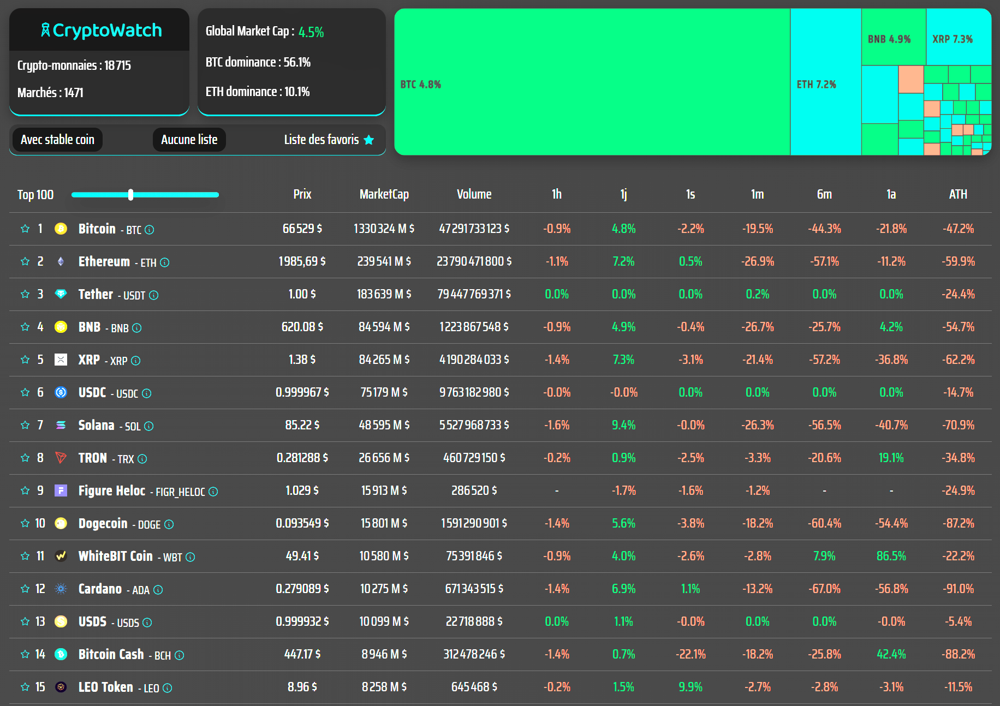

# Cryptowatch

Application web de suivi des cryptomonnaies développée avec React (Vite) et Node/Express, permettant de consulter les données de marché en temps réel via l’API CoinGecko.

## 🚀 Aperçu

## 📌 Fonctionnalités

- 💰 consultation des prix en temps réel
- 📊 affichage du Market Cap et du Volume
- 📈 variations sur : 1h / 24h / 7j / 1m / 6m / 1a / ATH
- 🏆 classement des Top 250 cryptomonnaies
- 🔄 mise à jour dynamique des données
- 🌐 communication Frontend ↔ Backend

## 🛠️ Technologies utilisées

### Frontend

- React
- Vite
- Axios / Fetch API
- Sass

### Backend

- Node.js
- Express
- API externe
- CoinGecko Public API

## ⚙️ Fonctionnement

- le frontend envoie une requête au backend
- le backend interroge l’API CoinGecko
- les données sont traitées et sécurisées côté serveur
- les informations sont renvoyées au frontend
- l’interface met à jour l’affichage dynamiquement

## 🎯 Objectifs du projet

Ce projet m’a permis de :

- comprendre la gestion des appels API
- maîtriser l’asynchronisme (async/await, Promises)
- structurer une architecture frontend/backend
- gérer les états et le rendu dynamique dans React
- organiser un projet fullstack

## 🎯 Ce que j’ai appris

- communication client ↔ serveur
- gestion des erreurs API
- optimisation des requêtes
- séparation des responsabilités (MVC simplifié)

## 👨‍💻 Auteur

CHARVOT Marc
GitHub : https://github.com/PYXHD
